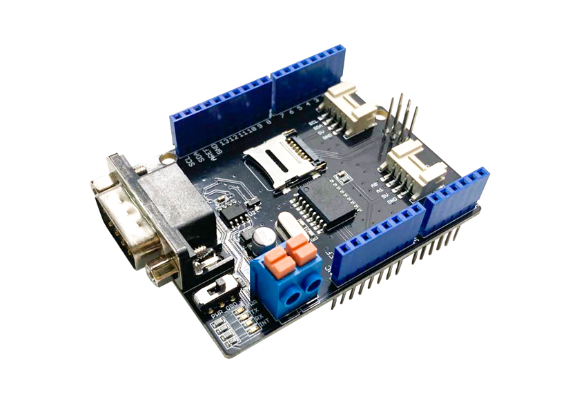
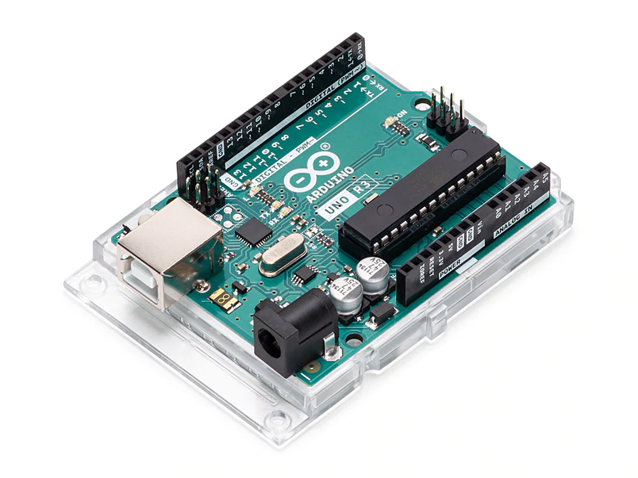

# Seed CAN Bus Shield

The [CAN-BUS Shield V2.0](https://wiki.seeedstudio.com/CAN-BUS_Shield_V2.0/) from Seed can be used together with for example an [Arduino Uno Rev3](https://en.wikipedia.org/wiki/Arduino_Uno) to communicate over CAN.

To simplify the discussion so will from here on the Arduino Uno Rev3 be called Arduino, and the Seed CAN-BUS Shield V2.0 will be called CAN-shield.

## About the Hardware

Below are pictures of the CAN-shield and the Arduino.

  
*Figure 1: CAN-Shield*

  
*Figure 2: Arduino*
